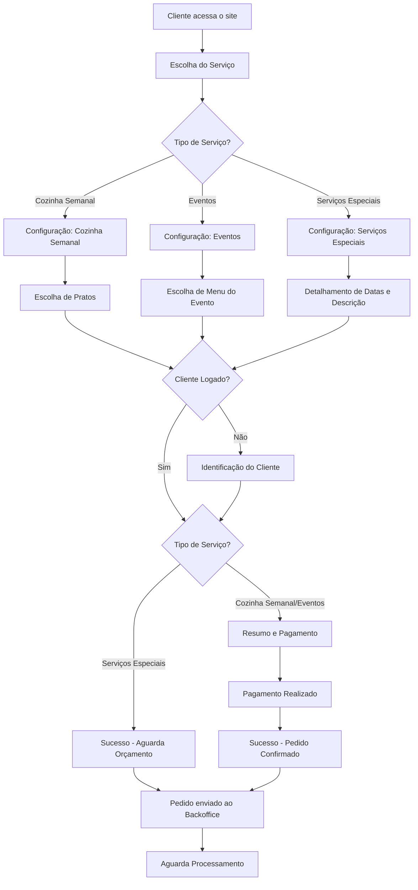
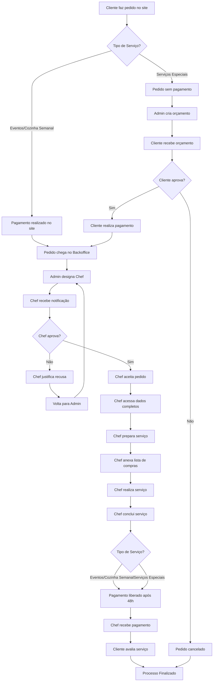
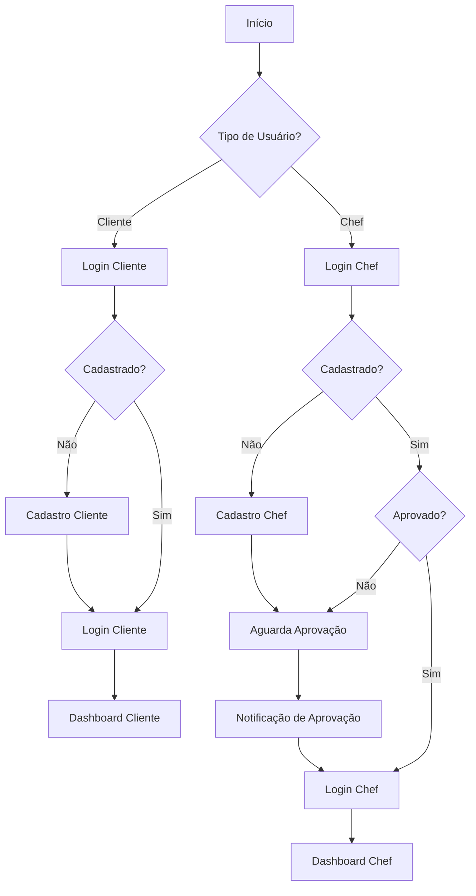
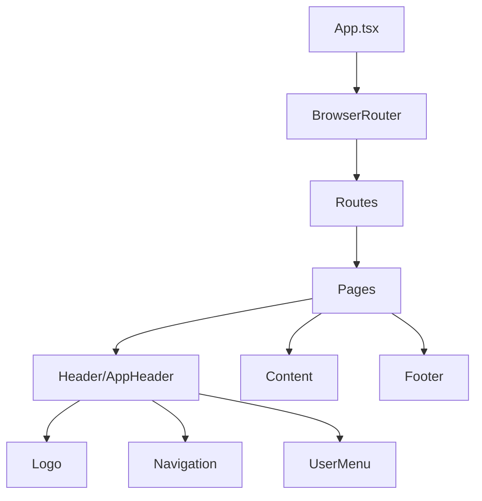

# Documentação Técnica - Take Your Time (TYT)

## 1. Visão Geral do Sistema

**Take Your Time** é uma plataforma web que conecta clientes a chefs profissionais para serviços de culinária domiciliar e eventos. O sistema possui dois perfis principais de usuário: **Cliente** e **Chef**, cada um com suas respectivas funcionalidades e fluxos de navegação.

### 1.1 Tecnologias Utilizadas

- **Frontend Framework**: React 18.3.1 com TypeScript
- **Build Tool**: Vite
- **Roteamento**: React Router DOM v6.30.1
- **Estilização**: Tailwind CSS com design system customizado
- **Componentes UI**: Shadcn/ui (Radix UI)
- **Gerenciamento de Estado**: React Hooks + React Query (TanStack Query)
- **Formulários**: React Hook Form com validação Zod
- **Ícones**: Lucide React
- **Notificações**: Sonner + Toast UI

### 1.2 Arquitetura do Projeto

```
src/
├── assets/              # Imagens, logos e recursos estáticos
├── components/          # Componentes reutilizáveis
│   ├── ui/             # Componentes base do design system
│   └── contratacao/    # Componentes específicos do fluxo de contratação
├── hooks/              # Custom hooks
├── lib/                # Utilitários e helpers
├── pages/              # Páginas/telas da aplicação
└── main.tsx           # Ponto de entrada da aplicação
```

---

## 2. Mapeamento Completo de Telas

### 2.1 Telas Públicas (Não Autenticadas)

#### **2.1.1 Home / Landing Page**

- **Rota**: `/`
- **Componente**: `Index.tsx`
- **Descrição**: Página inicial do sistema que apresenta a proposta de valor e direcionamento para diferentes perfis de usuário.

**Funcionalidades:**

- Apresentação da proposta de valor do serviço
- Card para clientes: acesso à contratação de serviços
- Card para chefs: cadastro e login de chefs
- Card informativo: link para site institucional

**Regras de Negócio:**

- RN001: Acesso público sem necessidade de autenticação
- RN002: Botão "Contratar" redireciona para `/contratacao`
- RN003: Botão "Minha Conta" (cliente) redireciona para `/login`
- RN004: Botão "Me cadastrar" (chef) redireciona para `/cadastro-chef`
- RN005: Botão "Fazer Login" (chef) redireciona para `/login/chef`

---

#### **2.1.2 Login Cliente**

- **Rota**: `/login`
- **Componente**: `Login.tsx`
- **Descrição**: Tela de autenticação para clientes.

**Funcionalidades:**

- Formulário de login com email e senha
- Opção "Lembrar de mim"
- Link para recuperação de senha
- Link para cadastro de novo cliente
- Autenticação com validação de credenciais

**Regras de Negócio:**

- RN006: Validação de formato de email
- RN007: Senha mínima de 6 caracteres
- RN008: Após login bem-sucedido, redireciona para `/dashboard-cliente`
- RN009: Opção de criar nova conta redirecionando para `/cadastro`
- RN010: Link "Esqueci minha senha" para recuperação

---

#### **2.1.3 Login Chef**

- **Rota**: `/login/chef`
- **Componente**: `LoginChef.tsx`
- **Descrição**: Tela de autenticação específica para chefs.

**Funcionalidades:**

- Formulário de login com email e senha
- Opção "Lembrar de mim"
- Link para recuperação de senha
- Link para cadastro de novo chef

**Regras de Negócio:**

- RN011: Validação de formato de email
- RN012: Senha mínima de 6 caracteres
- RN013: Após login bem-sucedido, redireciona para `/dashboard-chef`
- RN014: Opção de criar nova conta redirecionando para `/cadastro-chef`

---

#### **2.1.4 Cadastro Cliente**

- **Rota**: `/cadastro`
- **Componente**: `Cadastro.tsx`
- **Descrição**: Formulário de cadastro para novos clientes.

**Funcionalidades:**

- Formulário com dados pessoais (nome, email, telefone, CPF)
- Criação de senha com confirmação
- Aceite de termos de uso e política de privacidade
- Validação de dados em tempo real

**Regras de Negócio:**

- RN015: CPF deve ser válido e único no sistema
- RN016: Email deve ser único no sistema
- RN017: Senha e confirmação devem ser idênticas
- RN018: Senha mínima de 8 caracteres com letras e números
- RN019: Telefone no formato (XX) XXXXX-XXXX
- RN020: Obrigatório aceitar termos de uso
- RN021: Após cadastro, redireciona para `/login`

---

#### **2.1.5 Cadastro Chef**

- **Rota**: `/cadastro-chef`
- **Componente**: `CadastroChef.tsx`
- **Descrição**: Formulário de cadastro extensivo para novos chefs.

**Funcionalidades:**

- Dados pessoais (nome, email, telefone, CPF)
- Dados profissionais (formação, experiência, especialidades)
- Upload de foto de perfil
- Upload de certificações
- Descrição profissional
- Áreas de atuação/cidades
- Criação de senha
- Aceite de termos

**Regras de Negócio:**

- RN022: CPF deve ser válido e único no sistema
- RN023: Email deve ser único no sistema
- RN024: Foto de perfil é obrigatória (JPG, PNG, máx 5MB)
- RN025: Mínimo 50 caracteres na descrição profissional
- RN026: Ao menos uma especialidade deve ser selecionada
- RN027: Cadastro entra em análise (status: "Pendente")
- RN028: Após cadastro, redireciona para `/cadastro-chef-sucesso`

---

#### **2.1.6 Cadastro Chef Sucesso**

- **Rota**: `/cadastro-chef-sucesso`
- **Componente**: `CadastroChefSucesso.tsx`
- **Descrição**: Confirmação de cadastro do chef.

**Funcionalidades:**

- Mensagem de sucesso
- Informação sobre análise do cadastro
- Prazo de retorno (48-72 horas)
- Botão para retornar à home

**Regras de Negócio:**

- RN029: Tela informativa sem ações adicionais
- RN030: Chef não pode fazer login até aprovação

---

#### **2.1.7 Contratação (Fluxo Público)**

- **Rota**: `/contratacao`
- **Componente**: `Contratacao.tsx`
- **Descrição**: Fluxo completo de contratação de serviços de chef (acesso público).

**Funcionalidades - Etapa 1: Escolha do Serviço**

- Seleção da cidade de atendimento
- Escolha do tipo de serviço:
  - Cozinha Semanal
  - Eventos
  - Serviços Especiais

**Regras de Negócio:**

- RN031: Cidade é obrigatória
- RN032: Tipo de serviço é obrigatório
- RN033: Botão "Continuar" habilitado apenas com seleções válidas

**Funcionalidades - Etapa 2: Configuração**

**2.1.7.1 Cozinha Semanal:**

- Tamanho da porção (pequena, média, grande)
- Categorias alimentares (vegetariano, vegano, sem glúten, etc.)
- Preferências culinárias
- Ingredientes que devem ser evitados
- Tipos de cozinha preferidos
- Dias e períodos de entrega

**Regras de Negócio:**

- RN034: Tamanho da porção é obrigatório
- RN035: Ao menos um dia de entrega deve ser selecionado
- RN036: Período (manhã/tarde/noite) obrigatório por dia selecionado

**2.1.7.2 Eventos:**

- Quantidade de pessoas (5-500)
- Data do evento (calendário)
- Horário de início e fim
- Tema do evento (pré-definidos ou personalizado)

**Regras de Negócio:**

- RN037: Quantidade mínima: 5 pessoas
- RN038: Quantidade máxima: 500 pessoas
- RN039: Data deve ser futura (mínimo 7 dias de antecedência)
- RN040: Horário fim deve ser posterior ao início
- RN041: Tema é obrigatório

**2.1.7.3 Serviços Especiais:**

- Orçamento estimado
- Tipo de orçamento (por serviço ou por pessoa)

**Regras de Negócio:**

- RN044: **Esta opção pula a Etapa 2 (Configuração) e vai direto para Etapa 3**

**Funcionalidades - Etapa 3: Escolha de Pratos / Detalhamento**

**2.1.7.3.1 Cozinha Semanal:**

- Visualização de cardápio com pratos disponíveis
- Seleção de pratos desejados
- Informações nutricionais
- Ingredientes e modo de preparo

**Regras de Negócio:**

- RN045: Mínimo de 1 pratos selecionados
- RN046: Pratos filtrados por preferências da etapa anterior

**2.1.7.3.2 Eventos:**

- Nível de serviço (Clássico ou Banquete)
- Cardápio sugerido baseado no tema
- Personalização de pratos
- Seleção de entradas, pratos principais e sobremesas

**Regras de Negócio:**

- RN047: Nível de serviço é obrigatório
- RN048: Clássico: mínimo 1 entrada, 1 principal, 1 sobremesa
- RN049: Banquete: mínimo 2 entradas, 2 principais, 2 sobremesas

**2.1.7.3.3 Serviços Especiais:**

- Campo de texto extenso: "Datas e descrição detalhada"
- Informações sobre necessidades específicas

**Regras de Negócio:**

- RN050: Descrição mínima: 100 caracteres
- RN051: Descrição deve incluir datas e detalhes específicos

**Funcionalidades - Etapa 4: Identificação** (apenas se não logado)

- Formulário de dados pessoais
- Opção de criar conta ou continuar como visitante
- Login para clientes já cadastrados

**Regras de Negócio:**

- RN052: Se usuário já logado, esta etapa é pulada
- RN053: Dados obrigatórios: nome, email, telefone
- RN054: Se criar conta, senha é obrigatória

**Funcionalidades - Etapa 5: Resumo e Pagamento**

- Resumo completo do serviço contratado
- Endereço de entrega/evento
- Seleção de forma de pagamento
- Cartão de crédito (salvos ou novo)
- Aceite de termos de contratação
- Cálculo de valor total

**Regras de Negócio:**

- RN055: Endereço completo é obrigatório
- RN056: Forma de pagamento obrigatória
- RN057: Aceite de termos obrigatório
- RN058: Validação de dados do cartão em tempo real
- RN059: **Serviços Especiais NÃO exibem esta etapa se usuário logado** (vão direto para Sucesso)
- RN060: Após conclusão, redireciona para tela de sucesso

**Funcionalidades - Tela de Sucesso**

- Confirmação da contratação
- Número do pedido
- Informações sobre próximos passos
- Mensagens específicas por tipo de serviço
- Botão para ir ao Dashboard

**Regras de Negócio:**

- RN061: Mensagem diferenciada para cada tipo de serviço
- RN062: Serviços Especiais: informa que receberá proposta em até 48h
- RN063: Email de confirmação enviado automaticamente

---

### 2.2 Telas de Cliente (Autenticadas)

#### **2.2.1 Dashboard Cliente**

- **Rota**: `/dashboard-cliente`
- **Componente**: `DashboardCliente.tsx`
- **Descrição**: Painel principal do cliente com visão geral dos serviços.

**Funcionalidades:**

- Cards de atalhos rápidos
- Visualização de serviços ativos
- Próximas entregas/eventos
- Acesso rápido a contratar novo serviço
- Notificações importantes

**Regras de Negócio:**

- RN064: Acesso apenas para usuários autenticados como cliente
- RN065: Exibe apenas serviços do cliente logado
- RN066: Ordenação: próximos eventos/entregas primeiro

---

#### **2.2.2 Contratação Logado**

- **Rota**: `/contratacao-logado`
- **Componente**: `Contratacao.tsx` (mesmo componente, estado diferente)
- **Descrição**: Fluxo de contratação para cliente autenticado.

**Funcionalidades:**

- Mesmo fluxo da contratação pública
- **Pula Etapa 4 (Identificação)** automaticamente
- Dados pessoais pré-preenchidos
- Cartões salvos disponíveis
- Endereços salvos disponíveis

**Regras de Negócio:**

- RN067: Identificação automática via sessão
- RN068: Total de etapas reduzido (4 etapas ao invés de 5)
- RN069: Endereços e cartões carregados do perfil
- RN070: Pode ir direto para Etapa 3 se state contiver `goToStep3: true`

---

#### **2.2.3 Meus Contratos**

- **Rota**: `/meus-contratos`
- **Componente**: `MeusContratos.tsx`
- **Descrição**: Lista de todos os contratos de cozinha semanal do cliente.

**Funcionalidades:**

- Lista de contratos (ativos, concluídos, cancelados)
- Filtros por status
- Busca por número do contrato ou chef
- Paginação
- Ações rápidas: ver detalhes, cancelar

**Regras de Negócio:**

- RN071: Exibe apenas contratos do cliente logado
- RN072: Status possíveis: Ativo, Pendente, Concluído, Cancelado
- RN073: Contratos ativos exibidos primeiro

---

#### **2.2.4 Detalhes do Contrato**

- **Rota**: `/detalhes-contrato/:id`
- **Componente**: `DetalheContrato.tsx`
- **Descrição**: Visualização detalhada de um contrato específico.

**Funcionalidades:**

- Informações completas do contrato
- Dados do chef atribuído
- Cardápio/serviços contratados
- Cronograma de entregas/execução
- Histórico de status

**Regras de Negócio:**

- RN075: Cliente só pode ver seus próprios contratos
- RN076: Avaliação disponível após conclusão do serviço

---

#### **2.2.5 Histórico de Pagamentos**

- **Rota**: `/historico-pagamento`
- **Componente**: `HistoricoPagamento.tsx`
- **Descrição**: Lista completa de pagamentos realizados.

**Funcionalidades:**

- Lista de transações (aprovadas, pendentes, recusadas)
- Filtros por data, status, valor
- Download de comprovantes
- Detalhes de cada transação
- Visualização de faturas

**Regras de Negócio:**

- RN079: Exibe apenas pagamentos do cliente logado
- RN080: Ordenação: mais recentes primeiro
- RN081: Comprovante em PDF disponível para transações
- RN082: Exibe últimos 4 dígitos do cartão usado

---

#### **2.2.6 Gerenciar Cartões**

- **Rota**: `/gerenciar-cartoes`
- **Componente**: `GerenciarCartoes.tsx`
- **Descrição**: Gestão dos cartões de crédito salvos.

**Funcionalidades:**

- Lista de cartões salvos
- Adicionar novo cartão
- Remover cartão
- Definir cartão padrão
- Visualização segura (últimos 4 dígitos)

**Regras de Negócio:**

- RN083: Máximo de 5 cartões salvos por cliente
- RN084: Cartão padrão usado automaticamente em novas contratações
- RN086: Dados sensíveis tokenizados (não armazenados diretamente)

---

#### **2.2.7 Editar Dados Pessoais**

- **Rota**: `/editar-dados`
- **Componente**: `EditarDadosPessoais.tsx`
- **Descrição**: Edição das informações cadastrais do cliente.

**Funcionalidades:**

- Atualização de dados pessoais
- Atualização de endereços
- Upload de foto de perfil
- Preferências de notificação

**Regras de Negócio:**

- RN087: CPF não pode ser alterado
- RN088: Alteração de email requer verificação
- RN090: Foto de perfil: máximo 20MB, com compressão e redução, formatos JPG/PNG

---

#### **2.2.8 Cardápio**

- **Rota**: `/cardapio`
- **Componente**: `Cardapio.tsx`
- **Descrição**: Visualização do cardápio completo disponível.

**Funcionalidades:**

- Catálogo de pratos com fotos
- Filtros por categoria, tipo de cozinha, restrições
- Busca por nome ou ingrediente
- Visualização de detalhes nutricionais
- Favoritar pratos
- Indicação de pratos mais pedidos

---

#### **2.2.9 Detalhes do Prato**

- **Rota**: `/prato/:id`
- **Componente**: `PratoDetalhes.tsx`
- **Descrição**: Visualização detalhada de um prato específico.

**Funcionalidades:**

- Foto em alta resolução
- Descrição completa
- Lista de ingredientes
- Informações nutricionais detalhadas

**Regras de Negócio:**

- RN097: Informações nutricionais certificadas

---

### 2.3 Telas de Chef (Autenticadas)

#### **2.3.1 Dashboard Chef**

- **Rota**: `/dashboard-chef`
- **Componente**: `DashboardChef.tsx`
- **Descrição**: Painel principal do chef com visão geral dos serviços.

**Funcionalidades:**

- Resumo de serviços ativos
- Próximos compromissos
- Estatísticas de desempenho
- Ganhos do mês
- Notificações de novos pedidos
- Avaliações recentes

**Regras de Negócio:**

- RN098: Acesso apenas para chefs aprovados
- RN099: Chefs pendentes veem mensagem de análise em andamento
- RN100: Atualização em tempo real de novos pedidos

---

#### **2.3.3 Agenda do Chef**

- **Rota**: `/agenda-chef`
- **Componente**: `AgendaChef.tsx`
- **Descrição**: Calendário com todos os compromissos do chef.

**Funcionalidades:**

- Visualização em calendário (mês, semana, dia)
- Compromissos coloridos por tipo de serviço
- Detalhes ao clicar no compromisso

---

#### **2.3.4 Serviços Ativos**

- **Rota**: `/servicos-ativos`
- **Componente**: `ServicosAtivos.tsx`
- **Descrição**: Lista de todos os serviços de cozinha semanal ativos do chef.

**Funcionalidades:**

- Cards de serviços em andamento
- Filtros por tipo e status
- Ordenação por data
- Ações rápidas: ver ordem de cozinha, iniciar serviço

**Regras de Negócio:**

- RN106: Exibe apenas serviços atribuídos ao chef logado

---

#### **2.3.5 Detalhes do Serviço**

- **Rota**: `/servico-detalhes/:id`
- **Componente**: `ServicoDetalhes.tsx`
- **Descrição**: Informações completas de um serviço específico.

**Funcionalidades:**

- Dados do cliente
- Endereço de atendimento
- Data e horário
- Cardápio/menu contratado
- Observações e restrições
- Contato do cliente
- Botão para gerar ficha

**Regras de Negócio:**

- RN109: Chef só acessa serviços atribuídos a ele
- RN110: Dados sensíveis do cliente (telefone completo) só após confirmação

---

#### **2.3.6 Ordem de Cozinha**

- **Rota**: `/ordem-de-cozinha/:id`
- **Componente**: `OrdemDeCozinha.tsx`
- **Descrição**: Documento técnico com instruções de preparo.

**Funcionalidades:**

- Lista completa de pratos
- Ingredientes necessários (quantidades)
- Ficha técnica
- Lista de compras

**Regras de Negócio:**

- RN113: Chef pode marcar itens como comprados

---

#### **2.3.7 Ordem Pendente**

- **Rota**: `/ordem-pendente/:id`
- **Componente**: `OrdemPendente.tsx`
- **Descrição**: Ordem de cozinha que ainda não foram finalizadas pelo chef.

**Funcionalidades:**

- Visualização prévia da ordem

---

#### **2.3.8 Meus Pagamentos (Chef)**

- **Rota**: `/meus-pagamentos`
- **Componente**: `MeusPagamentos.tsx`
- **Descrição**: Histórico de pagamentos recebidos pelo chef.

**Funcionalidades:**

- Lista de pagamentos recebidos
- Filtros por data, status, valor
- Detalhes de cada transação
- Download de comprovantes

---

#### **2.3.9 Editar Cadastro Chef**

- **Rota**: `/editar-cadastro-chef`
- **Componente**: `EditarCadastroChef.tsx`
- **Descrição**: Edição do perfil profissional do chef.

**Funcionalidades:**

- Atualização de dados pessoais
- Edição de biografia/descrição
- Atualização de especialidades
- Upload de novas certificações
- Atualização de foto de perfil
- Alteração de áreas de atuação
- Definição de disponibilidade

**Regras de Negócio:**

- RN123: Alterações em dados críticos requerem nova aprovação
- RN124: Foto de perfil obrigatória
- RN125: Biografia mínima: 50 caracteres
- RN126: Certificações com data de validade

---

### 2.4 Tela de Erro

#### **2.4.1 Página Não Encontrada (404)**

- **Rota**: `*` (catch-all)
- **Componente**: `NotFound.tsx`
- **Descrição**: Exibida quando rota não existe.

**Funcionalidades:**

- Mensagem de erro amigável
- Sugestão de páginas relevantes
- Botão para voltar à home
- Barra de busca

**Regras de Negócio:**

- RN127: Captura todas as rotas não definidas
- RN128: Mantém estado de autenticação

---

## 3. Fluxos de Negócio

### 3.1 Fluxo de Contratação do Cliente



### 3.2 Fluxo de Aprovação de Pedidos e Execução



### 3.3 Fluxo de Autenticação



---

## 4. Arquitetura de Componentes

### 4.1 Hierarquia de Componentes de Layout



### 4.2 Design System (UI Components)

O projeto utiliza componentes do **shadcn/ui** baseados em **Radix UI**:

**Componentes Básicos:**

- `button.tsx` - Botões com variantes
- `input.tsx` - Campos de entrada
- `textarea.tsx` - Campos de texto longo
- `checkbox.tsx` - Caixas de seleção
- `radio-group.tsx` - Grupos de opções
- `select.tsx` - Seleção dropdown
- `switch.tsx` - Alternadores
- `label.tsx` - Rótulos de campos

**Componentes de Feedback:**

- `toast.tsx` + `toaster.tsx` - Notificações
- `sonner.tsx` - Toast moderno
- `alert.tsx` - Alertas
- `alert-dialog.tsx` - Diálogos de confirmação
- `progress.tsx` - Barras de progresso
- `skeleton.tsx` - Loading states

**Componentes de Layout:**

- `card.tsx` - Cards
- `separator.tsx` - Separadores
- `accordion.tsx` - Acordeões
- `tabs.tsx` - Abas
- `dialog.tsx` - Modais
- `sheet.tsx` - Painéis laterais
- `drawer.tsx` - Gavetas mobile
- `popover.tsx` - Popovers
- `hover-card.tsx` - Cards de hover
- `tooltip.tsx` - Dicas

**Componentes de Navegação:**

- `navigation-menu.tsx` - Menus de navegação
- `menubar.tsx` - Barras de menu
- `dropdown-menu.tsx` - Menus dropdown
- `breadcrumb.tsx` - Breadcrumbs
- `pagination.tsx` - Paginação

**Componentes Avançados:**

- `calendar.tsx` - Calendário
- `carousel.tsx` - Carrosséis
- `table.tsx` - Tabelas
- `form.tsx` - Formulários estruturados
- `slider.tsx` - Controles deslizantes
- `scroll-area.tsx` - Áreas de scroll

### 4.3 Componentes Customizados

**Componentes de Contratação** (`src/components/contratacao/`):

1. **EtapaEscolhaServico.tsx**
   - Seleção de cidade e tipo de serviço
   - Props: `dados`, `onAvancar`

2. **EtapaConfiguracao.tsx**
   - Roteador para subcomponentes de configuração
   - Renderiza: `ConfiguracaoCozinhaSemanal`, `ConfiguracaoEventos`, `ConfiguracaoServicosEspeciais`

3. **EtapaEscolhaPratos.tsx**
   - Roteador para escolha de pratos/detalhamento
   - Renderiza: `EscolhaPratosCozinhaSemanal`, `EscolhaPratosEventos`, `DetalhamentoServicosEspeciais`

4. **EtapaIdentificacao.tsx**
   - Formulário de identificação
   - Login ou cadastro rápido

5. **EtapaResumoePagamento.tsx**
   - Resumo final
   - Seleção de pagamento
   - Confirmação

6. **TelaSuccesso.tsx**
   - Confirmação de contratação
   - Próximos passos

**Componentes de Layout** (`src/components/`):

1. **Header.tsx**
   - Cabeçalho para usuários não autenticados
   - Logo, navegação, botões de login/cadastro

2. **AppHeader.tsx**
   - Cabeçalho para usuários autenticados
   - Logo, menu do usuário, notificações

3. **AppMenu.tsx**
   - Menu lateral ou dropdown
   - Links para funcionalidades do perfil

4. **Footer.tsx**
   - Rodapé com links institucionais
   - Redes sociais, contato

5. **ServiceCard.tsx**
   - Card de serviço reutilizável
   - Usado na home

6. **ScrollToTop.tsx**
   - Utilitário para scroll automático em mudança de rota

7. **LogoText.tsx**
   - Componente de logo com texto

---

## 5. Sistema de Design

### 5.1 Paleta de Cores (Definida em `src/index.css`)

**Cores Principais:**

- **TYT Blue**: `hsl(210, 80%, 30%)` - Cor primária da marca
- **TYT Yellow**: `hsl(45, 100%, 55%)` - Cor de destaque

**Cores Semânticas:**

- `--background`: Cor de fundo principal
- `--foreground`: Cor de texto principal
- `--primary`: Cor primária para ações
- `--secondary`: Cor secundária
- `--accent`: Cor de destaque
- `--destructive`: Cor para ações destrutivas
- `--muted`: Cor para elementos secundários
- `--border`: Cor de bordas

### 5.2 Tipografia

**Tamanhos Definidos:**

- `text-h1`: Títulos principais (3.5rem)
- `text-h2`: Títulos secundários (2.5rem)
- `text-h3`: Títulos terciários (2rem)
- `text-h4`: Títulos de seção (1.5rem)
- `text-body`: Texto padrão (1rem)

**Fontes:**

- Sistema de fontes nativas (`system-ui`, `-apple-system`, etc.)

### 5.3 Espaçamento e Grid

- Sistema de espaçamento baseado em múltiplos de 4px
- Grid responsivo usando Tailwind CSS
- Breakpoints: `sm`, `md`, `lg`, `xl`, `2xl`

---

## 6. Gerenciamento de Estado

### 6.1 Estado Local (React Hooks)

**Hooks Utilizados:**

- `useState` - Estado local de componentes
- `useEffect` - Efeitos colaterais
- `useNavigate` - Navegação programática
- `useLocation` - Informações de rota atual
- `useParams` - Parâmetros de rota

### 6.2 Estado Global (React Query)

**Configuração:**

```typescript
const queryClient = new QueryClient();
```

**Uso:**

- Cache de requisições
- Sincronização automática
- Otimizações de performance

### 6.3 Formulários (React Hook Form + Zod)

**Validação:**

- Validação em tempo real
- Schemas Zod para tipagem e validação
- Mensagens de erro customizadas

---

## 7. Rotas e Navegação

### 7.1 Estrutura de Rotas

```typescript
<Routes>
  {/* Públicas */}
  <Route path="/" element={<Index />} />
  <Route path="/login" element={<Login />} />
  <Route path="/login/chef" element={<LoginChef />} />
  <Route path="/cadastro" element={<Cadastro />} />
  <Route path="/cadastro-chef" element={<CadastroChef />} />
  <Route path="/contratacao" element={<Contratacao />} />

  {/* Cliente Autenticado */}
  <Route path="/dashboard-cliente" element={<DashboardCliente />} />
  <Route path="/meus-contratos" element={<MeusContratos />} />
  <Route path="/detalhes-contrato/:id" element={<DetalheContrato />} />
  <Route path="/historico-pagamento" element={<HistoricoPagamento />} />
  <Route path="/gerenciar-cartoes" element={<GerenciarCartoes />} />
  <Route path="/editar-dados" element={<EditarDadosPessoais />} />

  {/* Chef Autenticado */}
  <Route path="/dashboard-chef" element={<DashboardChef />} />
  <Route path="/dashboard-chef2" element={<DashboardChef2 />} />
  <Route path="/agenda-chef" element={<AgendaChef />} />
  <Route path="/servicos-ativos" element={<ServicosAtivos />} />
  <Route path="/servico-detalhes/:id" element={<ServicoDetalhes />} />
  <Route path="/ordem-de-cozinha/:id" element={<OrdemDeCozinha />} />
  <Route path="/ordem-pendente/:id" element={<OrdemPendente />} />
  <Route path="/meus-pagamentos" element={<MeusPagamentos />} />
  <Route path="/editar-cadastro-chef" element={<EditarCadastroChef />} />

  {/* Compartilhadas */}
  <Route path="/cardapio" element={<Cardapio />} />
  <Route path="/prato/:id" element={<PratoDetalhes />} />

  {/* 404 */}
  <Route path="*" element={<NotFound />} />
</Routes>
```

### 7.2 Proteção de Rotas

**Implementação Necessária:**

- HOC ou Context para verificar autenticação
- Redirecionamento automático para login
- Diferenciação entre rotas de cliente e chef

---

## 8. Integrações e APIs

### 8.1 Backend (A ser implementado)

**Endpoints Necessários:**

**Autenticação:**

- `POST /api/auth/login`
- `POST /api/auth/register`
- `POST /api/auth/logout`
- `POST /api/auth/refresh-token`
- `POST /api/auth/forgot-password`

**Clientes:**

- `GET /api/clientes/:id`
- `PUT /api/clientes/:id`
- `DELETE /api/clientes/:id`

**Chefs:**

- `POST /api/chefs/register`
- `GET /api/chefs/:id`
- `PUT /api/chefs/:id`
- `GET /api/chefs/status/:id`

**Contratos:**

- `POST /api/contratos`
- `GET /api/contratos`
- `GET /api/contratos/:id`
- `PUT /api/contratos/:id`
- `DELETE /api/contratos/:id`

**Cardápio:**

- `GET /api/pratos`
- `GET /api/pratos/:id`
- `GET /api/pratos/categoria/:categoria`

**Pagamentos:**

- `POST /api/pagamentos`
- `GET /api/pagamentos/cliente/:id`
- `GET /api/pagamentos/chef/:id`

**Ordens de Cozinha:**

- `GET /api/ordens/:servicoId`
- `PUT /api/ordens/:id/aceitar`
- `PUT /api/ordens/:id/recusar`

### 8.2 Gateway de Pagamento

**Integração Recomendada:**

- Stripe ou Mercado Pago
- Tokenização de cartões
- Webhooks para confirmação de pagamento

### 8.3 Armazenamento de Arquivos

**Upload de Imagens:**

- Fotos de perfil (clientes e chefs)
- Fotos de pratos
- Certificações de chefs
- Comprovantes de pagamento

**Storage Recomendado:**

- AWS S3 ou similar
- Cloudinary para otimização automática

---

## 9. Segurança

### 9.1 Autenticação e Autorização

**Estratégia:**

- JWT (JSON Web Tokens) para sessões
- Refresh tokens para longevidade
- HttpOnly cookies para armazenamento seguro

**Níveis de Acesso:**

- **Público**: Acesso sem autenticação
- **Cliente**: Acesso a funcionalidades de cliente
- **Chef**: Acesso a funcionalidades de chef
- **Admin**: Gestão da plataforma (a ser implementado)

### 9.2 Validação de Dados

**Frontend:**

- Validação com Zod schemas
- Sanitização de inputs
- Máscaras de entrada (CPF, telefone, cartão)

**Backend:**

- Validação duplicada no servidor
- Proteção contra SQL Injection
- Rate limiting

### 9.3 Proteção de Dados Sensíveis

**Dados Protegidos:**

- Senhas (hash bcrypt)
- Cartões de crédito (tokenização)
- CPF/Documentos (criptografia)
- Endereços completos

**Compliance:**

- LGPD (Lei Geral de Proteção de Dados)
- PCI-DSS (para pagamentos)

---

## 10. Performance e Otimizações

### 10.1 Otimizações Implementadas

- **Code Splitting**: Lazy loading de rotas
- **Image Optimization**: Compressão e lazy load de imagens
- **Caching**: React Query para cache de requisições
- **Memoization**: React.memo para componentes pesados

### 10.2 Métricas de Performance

**Targets:**

- First Contentful Paint (FCP): < 1.5s
- Largest Contentful Paint (LCP): < 2.5s
- Time to Interactive (TTI): < 3.5s
- Cumulative Layout Shift (CLS): < 0.1

---

## 11. Testes (Recomendações)

### 11.1 Testes Unitários

**Framework Recomendado:** Jest + React Testing Library

**Cobertura Mínima:**

- Componentes UI: 80%
- Hooks customizados: 90%
- Utilitários: 95%

### 11.2 Testes de Integração

**Cenários Críticos:**

- Fluxo de contratação completo
- Autenticação e autorização
- Processamento de pagamentos

### 11.3 Testes E2E

**Framework Recomendado:** Cypress ou Playwright

**Fluxos a Testar:**

- Cadastro e login (cliente e chef)
- Contratação completa de cada tipo de serviço
- Dashboard e gestão de contratos

---

## 12. Deploy e Infraestrutura

### 12.1 Ambientes

**Desenvolvimento:**

- Local com Vite dev server
- Hot reload habilitado

**Staging:**

- Deploy automático de branch `develop`
- Testes integrados

**Produção:**

- Deploy de branch `main`
- CI/CD com verificações

### 12.2 Build de Produção

```bash
npm run build
```

**Otimizações:**

- Minificação de JavaScript e CSS
- Tree shaking
- Asset optimization
- Gzip/Brotli compression

### 12.3 Hospedagem Recomendada

**Frontend:**

- Vercel
- Netlify
- AWS S3 + CloudFront

**Backend:**

- AWS (EC2, Lambda)
- Heroku
- DigitalOcean

---

## 13. Monitoramento e Analytics

### 13.1 Ferramentas Recomendadas

**Monitoramento de Erros:**

- Sentry
- Rollbar

**Analytics:**

- Google Analytics
- Mixpanel
- Hotjar (heatmaps)

**Performance:**

- Lighthouse
- Web Vitals
- New Relic

### 13.2 Métricas de Negócio

**KPIs Importantes:**

- Taxa de conversão (visitante → contratação)
- Tempo médio de contratação
- Taxa de retenção de clientes
- NPS (Net Promoter Score)
- Taxa de aceitação de ordens pelos chefs
- Valor médio de pedido (ticket médio)

---

## 14. Manutenção e Evolução

### 14.1 Backlog de Melhorias

**Funcionalidades Futuras:**

- Sistema de chat em tempo real
- Aplicativo mobile (React Native)
- Sistema de fidelidade/pontos
- Agendamento recorrente automatizado
- Integração com calendários externos (Google, Outlook)
- Área administrativa completa
- Relatórios e dashboards analíticos
- Sistema de avaliação e reviews

### 14.2 Refatorações Recomendadas

**Áreas de Melhoria:**

- Implementação de Context API para autenticação
- Separação de lógica de negócio em hooks customizados
- Implementação de testes automatizados
- Documentação de componentes com Storybook
- Internacionalização (i18n)

---

## 15. Glossário de Termos

- **Chef**: Profissional de culinária cadastrado na plataforma
- **Cliente**: Usuário que contrata serviços de chef
- **Contrato**: Acordo de prestação de serviço entre cliente e chef
- **Ordem de Cozinha**: Documento técnico com instruções de preparo
- **Serviço Ativo**: Contrato confirmado e em execução
- **Cozinha Semanal**: Modalidade de serviço recorrente
- **Eventos**: Modalidade para ocasiões especiais
- **Serviços Especiais**: Modalidade customizada sob consulta
- **Dashboard**: Painel de controle do usuário
- **RLS (Row Level Security)**: Segurança em nível de linha (banco de dados)
- **JWT (JSON Web Token)**: Token de autenticação

---

## 16. Contatos e Suporte

**Documentação Técnica Criada por:** Sistema TYT  
**Data:** 2025  
**Versão:** 1.0

**Para Suporte Técnico:**

- Documentação adicional disponível no código-fonte
- Comentários inline nos componentes principais
- README.md na raiz do projeto

---

## 17. Changelog

### Versão 1.0 (Atual)

- Implementação inicial de todas as telas principais
- Fluxo de contratação completo
- Dashboards de cliente e chef
- Sistema de autenticação
- Design system baseado em Tailwind CSS

### Próximas Versões (Roadmap)

- v1.1: Implementação de backend e APIs
- v1.2: Chat integrado
- v1.3: Aplicativo mobile
- v2.0: Área administrativa e analytics

---

# DOCUMENTAÇÃO DO PAINEL ADMINISTRATIVO (BACKOFFICE)

## 1. Visão Geral do Backoffice

O painel administrativo TYT é a interface central para gerenciamento completo da plataforma. Permite aos administradores controlar todos os aspectos operacionais, financeiros e de conteúdo do sistema.

### 1.1 Objetivos

- Centralizar gestão operacional da plataforma
- Controlar fluxo de aprovação de pedidos e designação de chefs
- Gerenciar conteúdo dinâmico (pratos, temas, ingredientes)
- Monitorar pagamentos e extratos financeiros
- Auditar atividades e garantir compliance
- Gerar relatórios gerenciais

### 1.2 Perfis de Acesso

- **Super Administrador**: Acesso total ao sistema
- **Administrador**: Gestão operacional (pedidos, chefs, clientes)
- **Financeiro**: Acesso a pagamentos e extratos
- **Moderador de Conteúdo**: Gestão de cardápio e temas
- **Suporte**: Visualização e suporte ao cliente

---

## 2. Módulos do Backoffice

### 2.1 Dashboard Principal

**Funcionalidades:**

- Visão geral de KPIs em tempo real
- Pedidos pendentes de aprovação
- Chefs aguardando designação
- Alertas e notificações importantes
- Gráficos de performance (receita, novos clientes, taxa de aprovação)
- Atalhos rápidos para ações frequentes

**Métricas Exibidas:**

- Total de pedidos do dia/semana/mês
- Receita total e por tipo de serviço
- Taxa de conversão de orçamentos
- Chefs ativos vs inativos
- Avaliação média dos serviços
- Tickets médios por tipo de serviço

---

### 2.2 Módulo de Usuários Administrativos

**Funcionalidades:**

- Listagem de todos os usuários admin
- Cadastro de novo administrador
- Edição de dados e permissões
- Exclusão lógica (status: ativo/inativo)
- Controle de roles (super admin, admin, financeiro, moderador, suporte)
- Histórico de ações do usuário
- Logs de login e atividades

**Campos da Listagem:**

- Nome completo
- Email
- Role/Perfil
- Status (ativo/inativo)
- Último acesso
- Data de criação
- Ações (editar, desativar, ver logs)

**Busca e Filtros:**

- Busca simples: nome, email
- Busca avançada: role, status, data de criação, último acesso
- Exportação: PDF, Excel

---

### 2.3 Módulo de Clientes

**Funcionalidades:**

- Listagem completa de clientes
- Visualização detalhada de perfil
- Edição de dados cadastrais
- Exclusão lógica (status: ativo/inativo/bloqueado)
- Histórico de pedidos do cliente
- Histórico de pagamentos
- Anotações administrativas

**Campos da Listagem:**

- Nome completo
- Email
- Telefone
- CPF
- Total de pedidos
- Valor total gasto
- Data de cadastro
- Status
- Última compra
- Ações

**Busca e Filtros:**

- Busca simples: nome, email, CPF, telefone
- Busca avançada: status, data de cadastro, total gasto (range), quantidade de pedidos
- Exportação: PDF, Excel, CSV

**Detalhes do Cliente:**

- Dados pessoais completos
- Endereços cadastrados
- Cartões de crédito (últimos 4 dígitos)
- Histórico de pedidos (tabela)
- Histórico de pagamentos (tabela)
- Avaliações feitas
- Anotações administrativas (campo de texto livre)

---

### 2.4 Módulo de Chefs

**Funcionalidades:**

- Listagem completa de chefs
- Visualização de perfil detalhado
- Aprovação/rejeição de cadastros novos
- Edição de dados cadastrais
- Exclusão lógica (status: ativo/inativo/pendente/bloqueado)
- Histórico de serviços realizados
- Extrato financeiro individual
- Avaliações recebidas
- Documentação anexada

**Campos da Listagem:**

- Nome completo
- Email
- Telefone
- CPF
- Especialidades
- Avaliação média (estrelas)
- Total de serviços
- Status (pendente/ativo/inativo/bloqueado)
- Data de cadastro
- Ações

**Busca e Filtros:**

- Busca simples: nome, email, CPF
- Busca avançada: status, especialidade, avaliação mínima, total de serviços, data de cadastro
- Exportação: PDF, Excel

**Detalhes do Chef:**

- Dados pessoais completos
- Documentos (CNH, RG, certificados)
- Especialidades e experiência
- Histórico de serviços (tabela)
- Extrato financeiro (tabela)
- Avaliações recebidas
- Taxa de aceitação de pedidos
- Taxa de conclusão de serviços
- Anotações administrativas

---

### 2.5 Módulo de Pedidos/Contratos

**Funcionalidades Principais:**

- Listagem de todos os pedidos
- Filtros por status múltiplos
- Designação de chef ao pedido
- Criação de orçamento (serviços especiais)
- Envio de orçamento ao cliente
- Acompanhamento de aprovação
- Visualização de timeline do pedido
- Cancelamento com justificativa
- Exportação de dados

**Status de Pedido:**

1. **Aguardando Orçamento** (apenas serviços especiais)
2. **Orçamento Enviado** (aguardando aprovação cliente)
3. **Aguardando Pagamento** (cliente aprovou orçamento)
4. **Pagamento Confirmado** (pago, aguardando designação chef)
5. **Aguardando Chef** (admin designou, chef ainda não respondeu)
6. **Chef Recusou** (chef rejeitou, precisa redesignar)
7. **Confirmado** (chef aceitou, serviço agendado)
8. **Em Andamento** (chef iniciou execução)
9. **Concluído** (chef finalizou)
10. **Avaliado** (cliente avaliou)
11. **Cancelado** (com justificativa)

**Campos da Listagem:**

- ID do pedido
- Cliente (nome)
- Tipo de serviço
- Data do serviço
- Valor total
- Status atual
- Chef designado (se houver)
- Data de criação
- Ações

**Busca e Filtros:**

- Busca simples: ID, nome cliente, nome chef
- Busca avançada:
  - Status (múltipla seleção)
  - Tipo de serviço
  - Data do serviço (range)
  - Data de criação (range)
  - Valor (range)
  - Chef designado
- Exportação: PDF, Excel

**Ações Disponíveis (por status):**

- **Aguardando Orçamento**: Criar orçamento
- **Orçamento Enviado**: Visualizar orçamento, editar orçamento
- **Pagamento Confirmado**: Designar chef
- **Aguardando Chef**: Ver chef designado, alterar chef
- **Chef Recusou**: Redesignar chef, ver justificativa recusa
- **Confirmado**: Visualizar detalhes completos
- **Todos**: Cancelar pedido (com justificativa)

**Tela de Designação de Chef:**

- Lista de chefs disponíveis na data
- Filtro por especialidade compatível
- Avaliação média de cada chef
- Taxa de aceitação
- Distância do local do serviço
- Histórico de serviços similares
- Botão "Designar"

**Tela de Criação de Orçamento:**

- Formulário com:
  - Descrição do serviço
  - Itens de custo (ingredientes, deslocamento, etc)
  - Valor unitário e quantidade
  - Subtotal
  - Total geral
  - Observações
  - Prazo de validade do orçamento
- Botão "Enviar para Cliente"

---

### 2.6 Módulo de Ordens de Cozinha

**Funcionalidades:**

- Visualização de todas as ordens geradas
- Filtros por status e data
- Detalhes da ordem (pratos, ingredientes, instruções)
- Lista de compras anexada pelo chef
- Status de execução
- Exportação para impressão

**Status de Ordem:**

- **Pendente** (gerada automaticamente 48h antes)
- **Em Preparação** (chef visualizou)
- **Concluída** (chef finalizou)

**Campos da Listagem:**

- ID da ordem
- Pedido relacionado
- Chef responsável
- Cliente
- Data do serviço
- Status
- Lista de compras anexada (sim/não)
- Ações

**Busca e Filtros:**

- Busca simples: ID, nome chef, nome cliente
- Busca avançada: status, data do serviço (range), chef
- Exportação: PDF (formato de ordem de cozinha)

---

### 2.7 Módulo de Pagamentos

**Funcionalidades:**

- Listagem de todas as transações
- Detalhes de cada pagamento
- Status de pagamento
- Comprovantes
- Estornos
- Conciliação bancária
- Exportação financeira

**Status de Pagamento:**

- **Pendente** (aguardando processamento)
- **Processando** (gateway processando)
- **Aprovado** (confirmado)
- **Falhou** (erro no processamento)
- **Estornado** (reembolso realizado)
- **Cancelado**

**Campos da Listagem:**

- ID transação
- Pedido relacionado
- Cliente
- Tipo de serviço
- Valor
- Método de pagamento
- Status
- Data da transação
- Gateway (Stripe/MercadoPago)
- Ações

**Busca e Filtros:**

- Busca simples: ID transação, nome cliente
- Busca avançada: status, método pagamento, data (range), valor (range), gateway
- Exportação: PDF, Excel, CSV

**Detalhes do Pagamento:**

- Informações completas da transação
- Dados do pedido relacionado
- Método de pagamento usado
- ID do gateway
- Comprovante (link)
- Histórico de status
- Opções: visualizar comprovante, estornar (com justificativa)

---

### 2.8 Módulo de Extrato de Serviços

**Funcionalidades:**

- Visualização geral de todos os serviços realizados
- Filtro por chef específico
- Métricas de performance
- Exportação de relatórios

**Visão Geral:**

- Total de serviços realizados (período)
- Serviços por tipo
- Serviços por status
- Avaliação média
- Taxa de conclusão
- Gráficos de evolução

**Visão por Chef:**

- Selecionar chef específico
- Total de serviços realizados
- Tipos de serviço executados
- Avaliação média recebida
- Taxa de aceitação
- Taxa de conclusão
- Valor total gerado
- Tabela detalhada de serviços

**Campos da Tabela:**

- Data do serviço
- Cliente
- Tipo de serviço
- Valor
- Status
- Avaliação
- Observações

**Filtros:**

- Chef (dropdown)
- Período (data range)
- Tipo de serviço
- Status
- Avaliação mínima

**Exportação:** PDF, Excel

---

### 2.9 Módulo de Extrato Financeiro do Chef

**Funcionalidades:**

- Extrato detalhado de valores a receber/recebidos por chef
- Cálculo de comissão da plataforma
- Agendamento de pagamentos
- Histórico de repasses
- Exportação

**Campos da Listagem:**

- Chef (selecionável)
- Período
- Total de serviços
- Valor bruto
- Comissão plataforma (%)
- Valor líquido
- Status (a pagar/pago)
- Data prevista pagamento
- Ações

**Detalhamento:**

- Tabela de serviços do período:
  - Data serviço
  - Cliente
  - Tipo serviço
  - Valor bruto
  - Comissão
  - Valor líquido
  - Status pagamento
  - Data pagamento realizado

**Busca e Filtros:**

- Chef (dropdown)
- Período (data range)
- Status pagamento (a pagar/pago/atrasado)
- Exportação: PDF, Excel

**Ações:**

- Marcar como pago
- Gerar comprovante
- Enviar email ao chef

---

### 2.10 Módulo de Temas de Jantar

**Funcionalidades:**

- Listagem de todos os temas
- Cadastro de novo tema
- Edição de tema existente
- Exclusão lógica (status ativo/inativo)
- Upload de imagem do tema
- Vinculação com pratos

**Campos do Cadastro:**

- Nome do tema (texto, max 100 chars)
- Descrição (textarea, max 500 chars)
- Imagem (upload, max 2MB, jpg/png/webp)
- Status (ativo/inativo)
- Ordem de exibição (número)
- Categoria (eventos/cozinha semanal/ambos)

**Campos da Listagem:**

- Miniatura
- Nome
- Categoria
- Nº pratos vinculados
- Status
- Ordem
- Ações (editar, desativar, visualizar pratos)

**Busca e Filtros:**

- Busca simples: nome
- Busca avançada: status, categoria
- Ordenação: ordem, nome, data criação
- Exportação: PDF com imagens

---

### 2.11 Módulo de Pratos

**Funcionalidades:**

- Listagem completa de pratos
- Cadastro de novo prato
- Edição de prato existente
- Exclusão lógica (status ativo/inativo)
- Upload de imagem do prato
- Vinculação com ingredientes
- Vinculação com temas
- Definição de categoria (entrada, prato principal, sobremesa, etc)

**Campos do Cadastro:**

- Nome do prato (texto, max 100 chars)
- Descrição curta (texto, max 200 chars)
- Descrição detalhada (textarea, max 1000 chars)
- Categoria (dropdown: entrada, prato principal, acompanhamento, sobremesa)
- Tipo de serviço aplicável (cozinha semanal/eventos/ambos)
- Imagem (upload, max 2MB)
- Tempo de preparo (número, minutos)
- Rendimento/Porções (número)
- Nível de dificuldade (fácil/médio/difícil)
- Ingredientes (seleção múltipla com quantidades)
- Temas relacionados (seleção múltipla)
- Restrições alimentares (vegetariano, vegano, sem glúten, etc)
- Valor sugerido (decimal)
- Status (ativo/inativo)

**Campos da Listagem:**

- Miniatura
- Nome
- Categoria
- Tipo serviço
- Temas vinculados
- Tempo preparo
- Valor
- Status
- Ações

**Busca e Filtros:**

- Busca simples: nome, ingredientes
- Busca avançada:
  - Categoria
  - Tipo serviço
  - Tema
  - Restrição alimentar
  - Status
  - Tempo preparo (range)
  - Valor (range)
- Exportação: PDF, Excel

---

### 2.12 Módulo de Ingredientes

**Funcionalidades:**

- Listagem de todos os ingredientes
- Cadastro de novo ingrediente
- Edição de ingrediente
- Exclusão lógica (status ativo/inativo)
- Categorização
- Unidades de medida

**Campos do Cadastro:**

- Nome (texto, max 100 chars)
- Categoria (carnes, vegetais, temperos, laticínios, grãos, etc)
- Unidade padrão (kg, g, L, mL, unidade, maço, etc)
- Custo médio (decimal, opcional)
- Fornecedor sugerido (texto, opcional)
- Observações (textarea)
- Status (ativo/inativo)

**Campos da Listagem:**

- Nome
- Categoria
- Unidade
- Custo médio
- Nº pratos usando
- Status
- Ações

**Busca e Filtros:**

- Busca simples: nome
- Busca avançada: categoria, status
- Ordenação: nome, categoria, custo
- Exportação: PDF, Excel

---

### 2.13 Módulo de Avaliações

**Funcionalidades:**

- Visualização de todas as avaliações
- Filtros por nota, chef, data
- Moderação de comentários
- Resposta a avaliações
- Denúncias
- Exclusão lógica de avaliações impróprias

**Campos da Listagem:**

- Data
- Cliente
- Chef avaliado
- Pedido
- Nota (1-5 estrelas)
- Comentário (preview)
- Status (publicada/oculta/denunciada)
- Ações

**Busca e Filtros:**

- Busca simples: cliente, chef
- Busca avançada:
  - Nota (range)
  - Data (range)
  - Status
  - Chef
- Exportação: PDF, Excel

**Detalhes da Avaliação:**

- Dados completos do pedido
- Nota e comentário
- Resposta do chef (se houver)
- Ações: ocultar, responder, denunciar

---

### 2.14 Módulo de Configurações do Sistema

**Funcionalidades:**

- Configurações gerais da plataforma
- Parâmetros de comissão
- Textos do site
- Emails automáticos
- Integrações (gateways pagamento)

**Seções:**

**A) Configurações Gerais:**

- Nome da plataforma
- Email de contato
- Telefone suporte
- Endereço físico
- Redes sociais

**B) Parâmetros Financeiros:**

- Taxa de comissão plataforma (%)
- Prazo liberação pagamento chef (horas)
- Métodos pagamento ativos
- Credenciais gateways (Stripe, MercadoPago)

**C) Configurações de Email:**

- Templates de emails automáticos:
  - Confirmação de cadastro
  - Pedido recebido
  - Orçamento enviado
  - Pagamento confirmado
  - Chef designado
  - Serviço concluído
  - Lembrete de avaliação
- SMTP configurações

**D) Integrações:**

- API keys de serviços externos
- Webhooks
- Google Analytics
- Facebook Pixel

**E) Políticas:**

- Termos de uso
- Política de privacidade
- Política de cancelamento

---

### 2.15 Módulo de Relatórios

**Funcionalidades:**

- Geração de relatórios customizados
- Dashboards analíticos
- Exportação em múltiplos formatos

**Relatórios Disponíveis:**

**A) Relatório de Vendas:**

- Período selecionável
- Filtros: tipo serviço, status
- Métricas: total vendas, ticket médio, quantidade pedidos
- Gráficos: evolução temporal, distribuição por tipo

**B) Relatório de Chefs:**

- Ranking por avaliação
- Ranking por quantidade serviços
- Ranking por receita gerada
- Taxa de aceitação
- Taxa de conclusão

**C) Relatório de Clientes:**

- Novos clientes (período)
- Clientes recorrentes
- Ticket médio por cliente
- LTV (Lifetime Value)

**D) Relatório Financeiro:**

- Receita total (período)
- Receita por tipo serviço
- Comissões geradas
- Pagamentos pendentes a chefs
- Fluxo de caixa

**E) Relatório de Performance:**

- Tempo médio de aprovação pedidos
- Taxa de conversão orçamentos
- Taxa de cancelamento
- Satisfação média (avaliações)

**Exportação:** PDF, Excel, CSV

---

### 2.17 Módulo de Logs e Auditoria

**Funcionalidades:**

- Registro de todas as ações administrativas
- Visualização de logs
- Filtros avançados
- Rastreabilidade completa

**Informações Registradas:**

- Data/hora da ação
- Usuário admin responsável
- Tipo de ação (criar, editar, excluir, visualizar)
- Módulo/Entidade afetada
- ID do registro afetado
- Dados anteriores (before)
- Dados posteriores (after)
- IP do usuário
- User Agent

**Campos da Listagem:**

- Data/hora
- Usuário
- Ação
- Módulo
- Entidade/ID
- Resumo mudança
- Ações (ver detalhes)

**Busca e Filtros:**

- Busca simples: usuário, entidade
- Busca avançada:
  - Data/hora (range)
  - Usuário admin
  - Tipo ação
  - Módulo
- Exportação: PDF, CSV

---

## 3. Modelo Relacional do Banco de Dados

### 3.1 Diagrama ER (Entity Relationship)

```mermaid
erDiagram
    users ||--o| profiles : "has"
    users ||--o| chefs : "has"
    users ||--o| admin_users : "has"

    profiles ||--o{ payment_methods : "has many"
    profiles ||--o{ contracts : "creates"
    profiles ||--o{ reviews : "writes"

    chefs ||--o{ contracts : "assigned to"
    chefs ||--o{ kitchen_orders : "executes"
    chefs ||--o{ chef_payouts : "receives"
    chefs ||--o{ reviews : "receives"

    admin_users ||--o{ admin_roles : "has"
    admin_users ||--o{ admin_notes : "creates"
    admin_users ||--o{ audit_logs : "performs"
    admin_users ||--o{ system_settings : "updates"
    admin_users ||--o{ email_templates : "updates"

    contracts ||--o{ contract_dishes : "contains"
    contracts ||--o| dinner_themes : "has theme"
    contracts ||--o| weekly_cooking_schedules : "has schedule"
    contracts ||--o{ kitchen_orders : "generates"
    contracts ||--o{ payments : "has payment"
    contracts ||--o{ chef_payouts : "generates payout"
    contracts ||--o| reviews : "receives review"

    dishes ||--o{ contract_dishes : "selected in"
    dishes ||--o{ dish_ingredients : "contains"
    dishes ||--o{ dish_themes : "belongs to"
    dishes ||--o{ dish_images : "has images"

    dinner_themes ||--o{ dish_themes : "contains"
    dinner_themes ||--o{ contracts : "selected in"

    ingredients ||--o{ dish_ingredients : "used in"

    users {
        uuid id PK
        string email
        string encrypted_password
        timestamp created_at
    }

    profiles {
        uuid id PK
        uuid user_id FK
        varchar full_name
        varchar cpf UK
        varchar phone
        date birth_date
        text avatar_url
        varchar cep
        varchar street
        varchar number
        varchar complement
        varchar neighborhood
        varchar city
        varchar state
        enum status
        timestamp created_at
        timestamp deleted_at
    }

    payment_methods {
        uuid id PK
        uuid user_id FK
        enum type
        varchar card_brand
        varchar last_four
        varchar cardholder_name
        int expiry_month
        int expiry_year
        boolean is_default
        text gateway_token
        timestamp deleted_at
    }

    chefs {
        uuid id PK
        uuid user_id FK
        varchar full_name
        varchar cpf UK
        varchar phone
        varchar email UK
        text bio
        text_array specialties
        text avatar_url
        enum status
        decimal average_rating
        int total_services
        decimal acceptance_rate
        decimal completion_rate
        timestamp deleted_at
    }

    admin_users {
        uuid id PK
        uuid user_id FK
        varchar full_name
        varchar email UK
        enum status
        timestamp last_login_at
        timestamp deleted_at
    }

    admin_roles {
        uuid id PK
        uuid admin_user_id FK
        enum role
        timestamp created_at
    }

    dinner_themes {
        uuid id PK
        varchar name
        varchar slug UK
        text description
        text image_url
        timestamp created_at
        timestamp deleted_at
    }

    ingredients {
        uuid id PK
        varchar name
        enum category
        enum unit
        decimal average_cost
        varchar supplier
        text notes
        enum status
        timestamp deleted_at
    }

    dishes {
        uuid id PK
        varchar name
        varchar slug UK
        varchar short_description
        text full_description
        enum category
        enum service_type
        enum status
        timestamp created_at
        timestamp deleted_at
    }

    dish_images {
        uuid id PK
        uuid dish_id FK
        text image_url
        int display_order
        timestamp created_at
    }

    dish_ingredients {
        uuid id PK
        uuid dish_id FK
        uuid ingredient_id FK
        enum portion_size
        decimal quantity
        varchar unit
        timestamp created_at
    }

    dish_themes {
        uuid id PK
        uuid dish_id FK
        uuid theme_id FK
        timestamp created_at
    }

    contracts {
        uuid id PK
        uuid client_id FK
        uuid chef_id FK
        enum service_type
        enum status
        date service_date
        time service_time
        int number_of_people
        uuid selected_theme_id FK
        text special_requests
        decimal subtotal
        decimal discount_amount
        decimal total_amount
        jsonb budget_details
        timestamp budget_sent_at
        timestamp chef_assigned_at
        timestamp chef_accepted_at
        text chef_rejection_reason
        timestamp completed_at
        timestamp cancelled_at
        text cancellation_reason
        timestamp created_at
        timestamp deleted_at
    }

    contract_dishes {
        uuid id PK
        uuid contract_id FK
        uuid dish_id FK
        int quantity
        text notes
        timestamp created_at
    }

    weekly_cooking_schedules {
        uuid id PK
        uuid contract_id FK
        enum frequency
        int_array days_of_week
        time preferred_time
        date start_date
        date end_date
        timestamp created_at
    }

    kitchen_orders {
        uuid id PK
        uuid contract_id FK
        uuid chef_id FK
        enum status
        date service_date
        timestamp generated_at
        text shopping_list_url
        text notes
        timestamp created_at
    }

    payments {
        uuid id PK
        uuid contract_id FK
        uuid client_id FK
        uuid payment_method_id FK
        decimal amount
        enum status
        enum payment_method_type
        enum gateway
        varchar gateway_transaction_id
        jsonb gateway_response
        text receipt_url
        timestamp paid_at
        timestamp refunded_at
        text refund_reason
        timestamp created_at
    }

    chef_payouts {
        uuid id PK
        uuid contract_id FK
        uuid chef_id FK
        decimal gross_amount
        decimal commission_percentage
        decimal commission_amount
        decimal net_amount
        enum status
        date scheduled_date
        date paid_date
        enum payment_method
        text receipt_url
        text notes
        timestamp created_at
    }

    reviews {
        uuid id PK
        uuid contract_id FK
        uuid client_id FK
        uuid chef_id FK
        int rating
        text comment
        text chef_response
        timestamp chef_responded_at
        enum status
        text hidden_reason
        timestamp created_at
    }

    admin_notes {
        uuid id PK
        uuid admin_user_id FK
        enum entity_type
        uuid entity_id
        text note
        boolean is_important
        timestamp created_at
    }

    audit_logs {
        uuid id PK
        uuid admin_user_id FK
        enum action
        varchar module
        varchar entity_type
        uuid entity_id
        jsonb before_data
        jsonb after_data
        inet ip_address
        text user_agent
        timestamp created_at
    }

    system_settings {
        uuid id PK
        varchar setting_key UK
        text setting_value
        enum setting_type
        text description
        boolean is_public
        uuid updated_by FK
        timestamp created_at
    }

    email_templates {
        uuid id PK
        varchar template_key UK
        varchar subject
        text body_html
        text body_text
        text_array variables
        text description
        boolean is_active
        uuid updated_by FK
        timestamp created_at
    }
```



### 3.2 Tabela: users (Auth - Supabase)

Gerenciada pelo Supabase Auth. Não modificável diretamente.

### 3.2 Tabela: profiles

**Descrição:** Perfis de todos os usuários (clientes) - inclui dados de endereço

| Campo        | Tipo      | Limite | Obrigatório | Chave         | Descrição                     |
| ------------ | --------- | ------ | ----------- | ------------- | ----------------------------- |
| id           | uuid      | -      | Sim         | PK, FK(users) | ID do usuário                 |
| full_name    | varchar   | 200    | Sim         | -             | Nome completo                 |
| cpf          | varchar   | 14     | Sim         | UNIQUE        | CPF (formato: 000.000.000-00) |
| phone        | varchar   | 20     | Sim         | -             | Telefone                      |
| birth_date   | date      | -      | Não         | -             | Data nascimento               |
| avatar_url   | text      | -      | Não         | -             | URL foto perfil               |
| cep          | varchar   | 10     | Não         | -             | CEP                           |
| street       | varchar   | 200    | Não         | -             | Rua                           |
| number       | varchar   | 20     | Não         | -             | Número                        |
| complement   | varchar   | 100    | Não         | -             | Complemento                   |
| neighborhood | varchar   | 100    | Não         | -             | Bairro                        |
| city         | varchar   | 100    | Não         | -             | Cidade                        |
| state        | varchar   | 2      | Não         | -             | UF                            |
| status       | enum      | -      | Sim         | -             | ativo, inativo, bloqueado     |
| created_at   | timestamp | -      | Sim         | -             | Data criação                  |
| updated_at   | timestamp | -      | Sim         | -             | Data atualização              |
| deleted_at   | timestamp | -      | Não         | -             | Exclusão lógica               |

**Índices:** cpf, status, cep, city, created_at

---

### 3.3 Tabela: payment_methods

**Descrição:** Métodos de pagamento dos clientes

| Campo           | Tipo      | Limite | Obrigatório | Chave        | Descrição               |
| --------------- | --------- | ------ | ----------- | ------------ | ----------------------- |
| id              | uuid      | -      | Sim         | PK           | ID método               |
| user_id         | uuid      | -      | Sim         | FK(profiles) | ID usuário              |
| type            | enum      | -      | Sim         | -            | credit_card, debit_card |
| card_brand      | varchar   | 50     | Sim         | -            | Visa, Mastercard, etc   |
| last_four       | varchar   | 4      | Sim         | -            | Últimos 4 dígitos       |
| cardholder_name | varchar   | 200    | Sim         | -            | Nome no cartão          |
| expiry_month    | int       | -      | Sim         | -            | Mês vencimento          |
| expiry_year     | int       | -      | Sim         | -            | Ano vencimento          |
| is_default      | boolean   | -      | Sim         | -            | Padrão                  |
| gateway_token   | text      | -      | Sim         | -            | Token gateway pagamento |
| created_at      | timestamp | -      | Sim         | -            | Data criação            |
| updated_at      | timestamp | -      | Sim         | -            | Data atualização        |
| deleted_at      | timestamp | -      | Não         | -            | Exclusão lógica         |

**Índices:** user_id, is_default

---

### 3.4 Tabela: chefs

**Descrição:** Perfis dos chefs

| Campo             | Tipo         | Limite | Obrigatório | Chave            | Descrição                             |
| ----------------- | ------------ | ------ | ----------- | ---------------- | ------------------------------------- |
| id                | uuid         | -      | Sim         | PK               | ID chef                               |
| user_id           | uuid         | -      | Sim         | FK(users) UNIQUE | ID usuário autenticação               |
| full_name         | varchar      | 200    | Sim         | -                | Nome completo                         |
| cpf               | varchar      | 14     | Sim         | UNIQUE           | CPF                                   |
| phone             | varchar      | 20     | Sim         | -                | Telefone                              |
| email             | varchar      | 200    | Sim         | UNIQUE           | Email                                 |
| birth_date        | date         | -      | Sim         | -                | Data nascimento                       |
| bio               | text         | 1000   | Não         | -                | Biografia/Experiência                 |
| specialties       | text[]       | -      | Não         | -                | Array especialidades                  |
| avatar_url        | text         | -      | Não         | -                | URL foto perfil                       |
| document_rg_url   | text         | -      | Não         | -                | URL RG digitalizado                   |
| document_cnh_url  | text         | -      | Não         | -                | URL CNH digitalizada                  |
| certificate_urls  | text[]       | -      | Não         | -                | Array URLs certificados               |
| bank_name         | varchar      | 100    | Não         | -                | Nome banco                            |
| bank_agency       | varchar      | 10     | Não         | -                | Agência                               |
| bank_account      | varchar      | 20     | Não         | -                | Conta                                 |
| bank_account_type | enum         | -      | Não         | -                | corrente, poupanca                    |
| pix_key           | varchar      | 200    | Não         | -                | Chave PIX                             |
| status            | enum         | -      | Sim         | -                | pendente, ativo, inativo, bloqueado   |
| approval_date     | timestamp    | -      | Não         | -                | Data aprovação cadastro               |
| average_rating    | decimal(3,2) | -      | Não         | -                | Média avaliações (0.00-5.00)          |
| total_services    | int          | -      | Sim         | -                | Total serviços realizados (default 0) |
| acceptance_rate   | decimal(5,2) | -      | Não         | -                | Taxa aceitação (%)                    |
| completion_rate   | decimal(5,2) | -      | Não         | -                | Taxa conclusão (%)                    |
| created_at        | timestamp    | -      | Sim         | -                | Data criação                          |
| updated_at        | timestamp    | -      | Sim         | -                | Data atualização                      |
| deleted_at        | timestamp    | -      | Não         | -                | Exclusão lógica                       |

**Índices:** user_id, cpf, email, status, average_rating

---

### 3.5 Tabela: admin_users

**Descrição:** Usuários administrativos do backoffice

| Campo         | Tipo      | Limite | Obrigatório | Chave            | Descrição        |
| ------------- | --------- | ------ | ----------- | ---------------- | ---------------- |
| id            | uuid      | -      | Sim         | PK               | ID admin         |
| user_id       | uuid      | -      | Sim         | FK(users) UNIQUE | ID autenticação  |
| full_name     | varchar   | 200    | Sim         | -                | Nome completo    |
| email         | varchar   | 200    | Sim         | UNIQUE           | Email            |
| status        | enum      | -      | Sim         | -                | ativo, inativo   |
| last_login_at | timestamp | -      | Não         | -                | Último login     |
| created_at    | timestamp | -      | Sim         | -                | Data criação     |
| updated_at    | timestamp | -      | Sim         | -                | Data atualização |
| deleted_at    | timestamp | -      | Não         | -                | Exclusão lógica  |

**Índices:** user_id, email, status

---

### 3.6 Tabela: admin_roles

**Descrição:** Roles de administradores (separada para segurança)

| Campo         | Tipo      | Limite | Obrigatório | Chave           | Descrição                                          |
| ------------- | --------- | ------ | ----------- | --------------- | -------------------------------------------------- |
| id            | uuid      | -      | Sim         | PK              | ID                                                 |
| admin_user_id | uuid      | -      | Sim         | FK(admin_users) | ID admin                                           |
| role          | enum      | -      | Sim         | -               | super_admin, admin, financeiro, moderador, suporte |
| created_at    | timestamp | -      | Sim         | -               | Data criação                                       |

**Índices:** admin_user_id, role  
**Constraint:** UNIQUE(admin_user_id, role) - permite múltiplos roles por admin

---

### 3.7 Tabela: dinner_themes

**Descrição:** Temas de jantar (apenas para eventos)

| Campo       | Tipo      | Limite | Obrigatório | Chave  | Descrição        |
| ----------- | --------- | ------ | ----------- | ------ | ---------------- |
| id          | uuid      | -      | Sim         | PK     | ID tema          |
| name        | varchar   | 100    | Sim         | -      | Nome tema        |
| slug        | varchar   | 100    | Sim         | UNIQUE | Slug para URL    |
| description | text      | 500    | Não         | -      | Descrição        |
| image_url   | text      | -      | Não         | -      | URL imagem       |
| created_at  | timestamp | -      | Sim         | -      | Data criação     |
| updated_at  | timestamp | -      | Sim         | -      | Data atualização |
| deleted_at  | timestamp | -      | Não         | -      | Exclusão lógica  |

**Índices:** slug, name

---

### 3.8 Tabela: ingredients

**Descrição:** Ingredientes

| Campo        | Tipo          | Limite | Obrigatório | Chave | Descrição                                                     |
| ------------ | ------------- | ------ | ----------- | ----- | ------------------------------------------------------------- |
| id           | uuid          | -      | Sim         | PK    | ID ingrediente                                                |
| name         | varchar       | 100    | Sim         | -     | Nome                                                          |
| category     | enum          | -      | Sim         | -     | carnes, vegetais, temperos, laticinios, graos, frutas, outros |
| unit         | enum          | -      | Sim         | -     | kg, g, l, ml, unidade, maco, dente, colher, xicara            |
| average_cost | decimal(10,2) | -      | Não         | -     | Custo médio unitário                                          |
| supplier     | varchar       | 200    | Não         | -     | Fornecedor sugerido                                           |
| notes        | text          | 500    | Não         | -     | Observações                                                   |
| status       | enum          | -      | Sim         | -     | ativo, inativo                                                |
| created_at   | timestamp     | -      | Sim         | -     | Data criação                                                  |
| updated_at   | timestamp     | -      | Sim         | -     | Data atualização                                              |
| deleted_at   | timestamp     | -      | Não         | -     | Exclusão lógica                                               |

**Índices:** name, category, status

---

### 3.9 Tabela: dishes

**Descrição:** Pratos do cardápio

| Campo             | Tipo      | Limite | Obrigatório | Chave  | Descrição                                           |
| ----------------- | --------- | ------ | ----------- | ------ | --------------------------------------------------- |
| id                | uuid      | -      | Sim         | PK     | ID prato                                            |
| name              | varchar   | 100    | Sim         | -      | Nome prato                                          |
| slug              | varchar   | 100    | Sim         | UNIQUE | Slug URL                                            |
| short_description | varchar   | 200    | Não         | -      | Descrição curta                                     |
| full_description  | text      | 1000   | Não         | -      | Descrição completa                                  |
| category          | enum      | -      | Sim         | -      | entrada, prato_principal, acompanhamento, sobremesa |
| service_type      | enum      | -      | Sim         | -      | cozinha_semanal, eventos, ambos                     |
| status            | enum      | -      | Sim         | -      | ativo, inativo                                      |
| created_at        | timestamp | -      | Sim         | -      | Data criação                                        |
| updated_at        | timestamp | -      | Sim         | -      | Data atualização                                    |
| deleted_at        | timestamp | -      | Não         | -      | Exclusão lógica                                     |

**Índices:** slug, category, service_type, status

---

### 3.10 Tabela: dish_images

**Descrição:** Imagens dos pratos (múltiplas fotos por prato)

| Campo         | Tipo      | Limite | Obrigatório | Chave      | Descrição         |
| ------------- | --------- | ------ | ----------- | ---------- | ----------------- |
| id            | uuid      | -      | Sim         | PK         | ID imagem         |
| dish_id       | uuid      | -      | Sim         | FK(dishes) | ID prato          |
| image_url     | text      | -      | Sim         | -          | URL da imagem     |
| display_order | int       | -      | Sim         | -          | Ordem de exibição |
| created_at    | timestamp | -      | Sim         | -          | Data criação      |

**Índices:** dish_id, display_order

---

### 3.11 Tabela: dish_ingredients

**Descrição:** Relacionamento pratos e ingredientes (N:N) - quantidade varia por porção

| Campo         | Tipo          | Limite | Obrigatório | Chave           | Descrição                   |
| ------------- | ------------- | ------ | ----------- | --------------- | --------------------------- |
| id            | uuid          | -      | Sim         | PK              | ID                          |
| dish_id       | uuid          | -      | Sim         | FK(dishes)      | ID prato                    |
| ingredient_id | uuid          | -      | Sim         | FK(ingredients) | ID ingrediente              |
| portion_size  | enum          | -      | Sim         | -               | pequena, media, grande      |
| quantity      | decimal(10,2) | -      | Sim         | -               | Quantidade para esta porção |
| unit          | varchar       | 20     | Sim         | -               | Unidade (ref ingrediente)   |
| created_at    | timestamp     | -      | Sim         | -               | Data criação                |

**Índices:** dish_id, ingredient_id, portion_size  
**Constraint:** UNIQUE(dish_id, ingredient_id, portion_size)

---

### 3.12 Tabela: dish_themes

**Descrição:** Relacionamento pratos e temas (N:N)

| Campo      | Tipo      | Limite | Obrigatório | Chave             | Descrição    |
| ---------- | --------- | ------ | ----------- | ----------------- | ------------ |
| id         | uuid      | -      | Sim         | PK                | ID           |
| dish_id    | uuid      | -      | Sim         | FK(dishes)        | ID prato     |
| theme_id   | uuid      | -      | Sim         | FK(dinner_themes) | ID tema      |
| created_at | timestamp | -      | Sim         | -                 | Data criação |

**Índices:** dish_id, theme_id  
**Constraint:** UNIQUE(dish_id, theme_id)

---

### 3.13 Tabela: contracts

**Descrição:** Contratos/Pedidos dos clientes

| Campo                 | Tipo          | Limite | Obrigatório | Chave             | Descrição                                    |
| --------------------- | ------------- | ------ | ----------- | ----------------- | -------------------------------------------- |
| id                    | uuid          | -      | Sim         | PK                | ID contrato                                  |
| client_id             | uuid          | -      | Sim         | FK(profiles)      | ID cliente                                   |
| chef_id               | uuid          | -      | Não         | FK(chefs)         | ID chef (null até designação)                |
| service_type          | enum          | -      | Sim         | -                 | cozinha_semanal, eventos, servicos_especiais |
| status                | enum          | -      | Sim         | -                 | Ver lista de status abaixo                   |
| service_date          | date          | -      | Sim         | -                 | Data do serviço                              |
| service_time          | time          | -      | Não         | -                 | Hora do serviço                              |
| number_of_people      | int           | -      | Sim         | -                 | Número de pessoas                            |
| selected_theme_id     | uuid          | -      | Não         | FK(dinner_themes) | Tema escolhido (se aplicável)                |
| special_requests      | text          | 2000   | Não         | -                 | Solicitações especiais                       |
| subtotal              | decimal(10,2) | -      | Sim         | -                 | Subtotal                                     |
| discount_amount       | decimal(10,2) | -      | Não         | -                 | Desconto                                     |
| total_amount          | decimal(10,2) | -      | Sim         | -                 | Total                                        |
| budget_details        | jsonb         | -      | Não         | -                 | Detalhes orçamento (serviços especiais)      |
| budget_sent_at        | timestamp     | -      | Não         | -                 | Data envio orçamento                         |
| budget_approved_at    | timestamp     | -      | Não         | -                 | Data aprovação orçamento                     |
| chef_assigned_at      | timestamp     | -      | Não         | -                 | Data designação chef                         |
| chef_accepted_at      | timestamp     | -      | Não         | -                 | Data aceitação chef                          |
| chef_rejection_reason | text          | 500    | Não         | -                 | Motivo recusa chef                           |
| completed_at          | timestamp     | -      | Não         | -                 | Data conclusão                               |
| cancelled_at          | timestamp     | -      | Não         | -                 | Data cancelamento                            |
| cancellation_reason   | text          | 500    | Não         | -                 | Motivo cancelamento                          |
| created_at            | timestamp     | -      | Sim         | -                 | Data criação                                 |
| updated_at            | timestamp     | -      | Sim         | -                 | Data atualização                             |
| deleted_at            | timestamp     | -      | Não         | -                 | Exclusão lógica                              |

**Status possíveis:**

- aguardando_orcamento
- orcamento_enviado
- aguardando_pagamento
- pagamento_confirmado
- aguardando_chef
- chef_recusou
- confirmado
- em_andamento
- concluido
- avaliado
- cancelado

**Índices:** client_id, chef_id, service_type, status, service_date

---

### 3.14 Tabela: contract_dishes

**Descrição:** Pratos selecionados no contrato

| Campo       | Tipo      | Limite | Obrigatório | Chave         | Descrição          |
| ----------- | --------- | ------ | ----------- | ------------- | ------------------ |
| id          | uuid      | -      | Sim         | PK            | ID                 |
| contract_id | uuid      | -      | Sim         | FK(contracts) | ID contrato        |
| dish_id     | uuid      | -      | Sim         | FK(dishes)    | ID prato           |
| quantity    | int       | -      | Sim         | -             | Quantidade/Porções |
| notes       | text      | 500    | Não         | -             | Observações        |
| created_at  | timestamp | -      | Sim         | -             | Data criação       |

**Índices:** contract_id, dish_id

---

### 3.15 Tabela: weekly_cooking_schedules

**Descrição:** Agendamento específico de cozinha semanal

| Campo          | Tipo      | Limite | Obrigatório | Chave         | Descrição                             |
| -------------- | --------- | ------ | ----------- | ------------- | ------------------------------------- |
| id             | uuid      | -      | Sim         | PK            | ID                                    |
| contract_id    | uuid      | -      | Sim         | FK(contracts) | ID contrato                           |
| frequency      | enum      | -      | Sim         | -             | semanal, quinzenal                    |
| days_of_week   | int[]     | -      | Sim         | -             | Array dias (0=dom, 1=seg, ..., 6=sab) |
| preferred_time | time      | -      | Não         | -             | Horário preferencial                  |
| start_date     | date      | -      | Sim         | -             | Início                                |
| end_date       | date      | -      | Não         | -             | Fim (null = indeterminado)            |
| created_at     | timestamp | -      | Sim         | -             | Data criação                          |
| updated_at     | timestamp | -      | Sim         | -             | Data atualização                      |

**Índices:** contract_id, start_date, end_date

---

### 3.16 Tabela: kitchen_orders

**Descrição:** Ordens de cozinha

| Campo             | Tipo      | Limite | Obrigatório | Chave         | Descrição                          |
| ----------------- | --------- | ------ | ----------- | ------------- | ---------------------------------- |
| id                | uuid      | -      | Sim         | PK            | ID ordem                           |
| contract_id       | uuid      | -      | Sim         | FK(contracts) | ID contrato                        |
| chef_id           | uuid      | -      | Sim         | FK(chefs)     | ID chef                            |
| status            | enum      | -      | Sim         | -             | pendente, em_preparacao, concluida |
| service_date      | date      | -      | Sim         | -             | Data serviço                       |
| generated_at      | timestamp | -      | Sim         | -             | Data geração (48h antes)           |
| shopping_list_url | text      | -      | Não         | -             | URL lista compras anexada          |
| notes             | text      | 1000   | Não         | -             | Observações chef                   |
| created_at        | timestamp | -      | Sim         | -             | Data criação                       |
| updated_at        | timestamp | -      | Sim         | -             | Data atualização                   |

**Índices:** contract_id, chef_id, status, service_date

---

### 3.17 Tabela: payments

**Descrição:** Transações de pagamento

| Campo                  | Tipo          | Limite | Obrigatório | Chave               | Descrição                                                     |
| ---------------------- | ------------- | ------ | ----------- | ------------------- | ------------------------------------------------------------- |
| id                     | uuid          | -      | Sim         | PK                  | ID pagamento                                                  |
| contract_id            | uuid          | -      | Sim         | FK(contracts)       | ID contrato                                                   |
| client_id              | uuid          | -      | Sim         | FK(profiles)        | ID cliente                                                    |
| payment_method_id      | uuid          | -      | Não         | FK(payment_methods) | Método usado                                                  |
| amount                 | decimal(10,2) | -      | Sim         | -                   | Valor                                                         |
| status                 | enum          | -      | Sim         | -                   | pendente, processando, aprovado, falhou, estornado, cancelado |
| payment_method_type    | enum          | -      | Sim         | -                   | credit_card, debit_card, pix, boleto                          |
| gateway                | enum          | -      | Sim         | -                   | stripe, mercadopago                                           |
| gateway_transaction_id | varchar       | 200    | Não         | -                   | ID transação gateway                                          |
| gateway_response       | jsonb         | -      | Não         | -                   | Resposta completa gateway                                     |
| receipt_url            | text          | -      | Não         | -                   | URL comprovante                                               |
| paid_at                | timestamp     | -      | Não         | -                   | Data pagamento                                                |
| refunded_at            | timestamp     | -      | Não         | -                   | Data estorno                                                  |
| refund_reason          | text          | 500    | Não         | -                   | Motivo estorno                                                |
| created_at             | timestamp     | -      | Sim         | -                   | Data criação                                                  |
| updated_at             | timestamp     | -      | Sim         | -                   | Data atualização                                              |

**Índices:** contract_id, client_id, status, gateway_transaction_id, paid_at

---

### 3.18 Tabela: chef_payouts

**Descrição:** Pagamentos/Repasses aos chefs

| Campo                 | Tipo          | Limite | Obrigatório | Chave         | Descrição               |
| --------------------- | ------------- | ------ | ----------- | ------------- | ----------------------- |
| id                    | uuid          | -      | Sim         | PK            | ID repasse              |
| contract_id           | uuid          | -      | Sim         | FK(contracts) | ID contrato             |
| chef_id               | uuid          | -      | Sim         | FK(chefs)     | ID chef                 |
| gross_amount          | decimal(10,2) | -      | Sim         | -             | Valor bruto             |
| commission_percentage | decimal(5,2)  | -      | Sim         | -             | % comissão plataforma   |
| commission_amount     | decimal(10,2) | -      | Sim         | -             | Valor comissão          |
| net_amount            | decimal(10,2) | -      | Sim         | -             | Valor líquido           |
| status                | enum          | -      | Sim         | -             | a_pagar, pago, atrasado |
| scheduled_date        | date          | -      | Sim         | -             | Data prevista pagamento |
| paid_date             | date          | -      | Não         | -             | Data real pagamento     |
| payment_method        | enum          | -      | Não         | -             | transferencia, pix      |
| receipt_url           | text          | -      | Não         | -             | Comprovante             |
| notes                 | text          | 500    | Não         | -             | Observações             |
| created_at            | timestamp     | -      | Sim         | -             | Data criação            |
| updated_at            | timestamp     | -      | Sim         | -             | Data atualização        |

**Índices:** contract_id, chef_id, status, scheduled_date, paid_date

---

### 3.18 Tabela: reviews

**Descrição:** Avaliações dos clientes

| Campo             | Tipo      | Limite | Obrigatório | Chave                | Descrição                     |
| ----------------- | --------- | ------ | ----------- | -------------------- | ----------------------------- |
| id                | uuid      | -      | Sim         | PK                   | ID avaliação                  |
| contract_id       | uuid      | -      | Sim         | FK(contracts) UNIQUE | ID contrato                   |
| client_id         | uuid      | -      | Sim         | FK(profiles)         | ID cliente                    |
| chef_id           | uuid      | -      | Sim         | FK(chefs)            | ID chef                       |
| rating            | int       | -      | Sim         | -                    | Nota 1-5                      |
| comment           | text      | 1000   | Não         | -                    | Comentário                    |
| chef_response     | text      | 1000   | Não         | -                    | Resposta do chef              |
| chef_responded_at | timestamp | -      | Não         | -                    | Data resposta                 |
| status            | enum      | -      | Sim         | -                    | publicada, oculta, denunciada |
| hidden_reason     | text      | 500    | Não         | -                    | Motivo ocultação              |
| created_at        | timestamp | -      | Sim         | -                    | Data criação                  |
| updated_at        | timestamp | -      | Sim         | -                    | Data atualização              |

**Índices:** contract_id, client_id, chef_id, rating, status

**Constraint:** CHECK (rating >= 1 AND rating <= 5)

---

### 3.19 Tabela: admin_notes

**Descrição:** Anotações administrativas

| Campo         | Tipo      | Limite | Obrigatório | Chave           | Descrição                |
| ------------- | --------- | ------ | ----------- | --------------- | ------------------------ |
| id            | uuid      | -      | Sim         | PK              | ID nota                  |
| admin_user_id | uuid      | -      | Sim         | FK(admin_users) | Admin que criou          |
| entity_type   | enum      | -      | Sim         | -               | client, chef, contract   |
| entity_id     | uuid      | -      | Sim         | -               | ID da entidade           |
| note          | text      | 2000   | Sim         | -               | Anotação                 |
| is_important  | boolean   | -      | Sim         | -               | Destacar (default false) |
| created_at    | timestamp | -      | Sim         | -               | Data criação             |
| updated_at    | timestamp | -      | Sim         | -               | Data atualização         |

**Índices:** entity_type, entity_id, admin_user_id, created_at

---

### 3.20 Tabela: audit_logs

**Descrição:** Logs de auditoria

| Campo         | Tipo      | Limite | Obrigatório | Chave           | Descrição                    |
| ------------- | --------- | ------ | ----------- | --------------- | ---------------------------- |
| id            | uuid      | -      | Sim         | PK              | ID log                       |
| admin_user_id | uuid      | -      | Sim         | FK(admin_users) | Admin responsável            |
| action        | enum      | -      | Sim         | -               | create, update, delete, view |
| module        | varchar   | 50     | Sim         | -               | Nome do módulo               |
| entity_type   | varchar   | 50     | Sim         | -               | Tipo entidade                |
| entity_id     | uuid      | -      | Sim         | -               | ID entidade                  |
| before_data   | jsonb     | -      | Não         | -               | Dados anteriores             |
| after_data    | jsonb     | -      | Não         | -               | Dados posteriores            |
| ip_address    | inet      | -      | Sim         | -               | IP usuário                   |
| user_agent    | text      | 500    | Não         | -               | User Agent                   |
| created_at    | timestamp | -      | Sim         | -               | Data/hora ação               |

**Índices:** admin_user_id, action, module, entity_type, entity_id, created_at

---

### 3.21 Tabela: system_settings

**Descrição:** Configurações gerais do sistema

| Campo         | Tipo      | Limite | Obrigatório | Chave           | Descrição                     |
| ------------- | --------- | ------ | ----------- | --------------- | ----------------------------- |
| id            | uuid      | -      | Sim         | PK              | ID                            |
| setting_key   | varchar   | 100    | Sim         | UNIQUE          | Chave configuração            |
| setting_value | text      | -      | Sim         | -               | Valor                         |
| setting_type  | enum      | -      | Sim         | -               | string, number, boolean, json |
| description   | text      | 500    | Não         | -               | Descrição                     |
| is_public     | boolean   | -      | Sim         | -               | Visível publicamente          |
| updated_by    | uuid      | -      | Não         | FK(admin_users) | Admin que alterou             |
| created_at    | timestamp | -      | Sim         | -               | Data criação                  |
| updated_at    | timestamp | -      | Sim         | -               | Data atualização              |

**Exemplos de settings:**

- platform_commission_percentage
- chef_payout_delay_hours
- site_name
- contact_email
- contact_phone
- stripe_public_key
- mercadopago_public_key
- google_analytics_id

**Índices:** setting_key, is_public

---

### 3.22 Tabela: email_templates

**Descrição:** Templates de emails automáticos

| Campo        | Tipo      | Limite | Obrigatório | Chave           | Descrição             |
| ------------ | --------- | ------ | ----------- | --------------- | --------------------- |
| id           | uuid      | -      | Sim         | PK              | ID                    |
| template_key | varchar   | 100    | Sim         | UNIQUE          | Chave template        |
| subject      | varchar   | 200    | Sim         | -               | Assunto               |
| body_html    | text      | -      | Sim         | -               | Corpo HTML            |
| body_text    | text      | -      | Sim         | -               | Corpo texto puro      |
| variables    | text[]    | -      | Não         | -               | Variáveis disponíveis |
| description  | text      | 500    | Não         | -               | Descrição uso         |
| is_active    | boolean   | -      | Sim         | -               | Ativo                 |
| updated_by   | uuid      | -      | Não         | FK(admin_users) | Admin que alterou     |
| created_at   | timestamp | -      | Sim         | -               | Data criação          |
| updated_at   | timestamp | -      | Sim         | -               | Data atualização      |

**Exemplos de templates:**

- registration_confirmation
- order_received
- budget_sent
- payment_confirmed
- chef_assigned
- service_completed
- review_reminder

**Índices:** template_key, is_active

---

## 4. Regras de Negócio do Backoffice

### 4.1 Exclusão Lógica (Soft Delete)

- **NUNCA** excluir fisicamente registros do banco
- Sempre usar campo `deleted_at` (timestamp)
- Filtrar registros excluídos em queries de listagem (WHERE deleted_at IS NULL)
- Manter integridade referencial mesmo com registros excluídos

### 4.2 Auditoria Obrigatória

- Toda ação administrativa deve gerar log em `audit_logs`
- Capturar: admin responsável, ação, módulo, entidade, dados before/after, IP, User Agent
- Logs nunca são excluídos

### 4.3 Permissões por Role

- **super_admin**: Acesso total irrestrito
- **admin**: Gestão operacional (pedidos, chefs, clientes) - não acessa configurações críticas
- **financeiro**: Acesso apenas a módulos financeiros (pagamentos, extratos, repasses)
- **moderador**: Gestão de conteúdo (pratos, temas, ingredientes, avaliações)
- **suporte**: Apenas visualização e anotações em clientes/chefs

### 4.4 Fluxo de Pedidos no Backoffice

**A) Serviços Especiais:**

1. Pedido criado → Status: `aguardando_orcamento`
2. Admin cria orçamento → Status: `orcamento_enviado`
3. Cliente aprova → Status: `aguardando_pagamento`
4. Cliente paga → Status: `pagamento_confirmado`
5. Admin designa chef → Status: `aguardando_chef`
6. Chef aceita → Status: `confirmado`
7. Chef recusa → Status: `chef_recusou` (volta para passo 5)

**B) Cozinha Semanal / Eventos:**

1. Pedido criado com pagamento → Status: `pagamento_confirmado`
2. Admin designa chef → Status: `aguardando_chef`
3. Chef aceita → Status: `confirmado`
4. Chef recusa → Status: `chef_recusou` (volta para passo 2)

### 4.5 Geração de Ordem de Cozinha

- Automática: 48h antes da `service_date` do contrato
- Apenas para contratos com status `confirmado`
- Criar registro em `kitchen_orders` com status `pendente`

### 4.6 Liberação de Pagamento ao Chef

- Calcular automaticamente após serviço `concluido`
- Aplicar percentual de comissão (obtido de `system_settings`)
- Criar registro em `chef_payouts` com `scheduled_date` = data conclusão + delay configurado
- Status inicial: `a_pagar`

### 4.7 Validações Críticas

- **CPF**: Validar formato e dígitos verificadores
- **Email**: Validar formato e unicidade
- **Datas**: Data de serviço deve ser futura (no cadastro)
- **Valores**: Sempre positivos, máximo 2 casas decimais
- **Status**: Transições de status devem seguir regras (ex: não pode ir de `cancelado` para `confirmado`)

---

## 5. Considerações Técnicas

### 5.1 Performance

- Índices em todos os campos usados em WHERE, JOIN, ORDER BY
- Paginação obrigatória em listagens (padrão: 50 registros/página)
- Cache de configurações do sistema (Redis recomendado)
- Lazy loading de imagens

### 5.2 Segurança

- **Row Level Security (RLS)** habilitado em todas as tabelas
- Validação de permissões no backend (não confiar apenas no frontend)
- Senhas com bcrypt (mínimo 10 rounds)
- Tokens JWT com expiração
- HTTPS obrigatório
- Rate limiting em APIs
- Sanitização de inputs (XSS, SQL Injection)
- Logs de acesso e alterações

### 5.3 Integrações

- **Gateway Pagamento**: Stripe e/ou Mercado Pago
- **Storage Arquivos**: AWS S3, Cloudinary ou similar
- **Email**: SendGrid, Mailgun ou SMTP customizado
- **Notificações Push**: Firebase Cloud Messaging (futuramente)

### 5.4 Backup e Recuperação

- Backup automático diário do banco de dados
- Retenção mínima: 30 dias
- Testes de restore mensais
- Backup de arquivos (imagens, documentos) em storage separado

### 5.5 Monitoramento

- Logs de erro (Sentry ou similar)
- Métricas de performance (New Relic, Datadog)
- Alertas automáticos para:
  - Erros críticos
  - Performance degradada
  - Falhas de pagamento
  - Fila de pedidos acumulando

---

## 6. Roadmap de Implementação do Backoffice

### Fase 1 - MVP (Essencial)

1. Autenticação e permissões admin
2. Dashboard principal com KPIs
3. Módulo de Pedidos (listagem, designação chef, orçamentos)
4. Módulo de Chefs (aprovação, gestão)
5. Módulo de Clientes (listagem, visualização)
6. Módulo de Pagamentos (visualização, estornos)
7. Logs de auditoria básicos

### Fase 2 - Gestão de Conteúdo

8. Módulo de Temas
9. Módulo de Pratos
10. Módulo de Ingredientes
11. Módulo de Avaliações

### Fase 3 - Financeiro Completo

12. Módulo Extrato de Serviços
13. Módulo Extrato Financeiro Chef
14. Relatórios financeiros
15. Conciliação bancária

### Fase 4 - Avançado

16. Módulo de Configurações
17. Módulo de Relatórios customizados
18. Análise preditiva (BI)

---

**FIM DA DOCUMENTAÇÃO DO BACKOFFICE**
